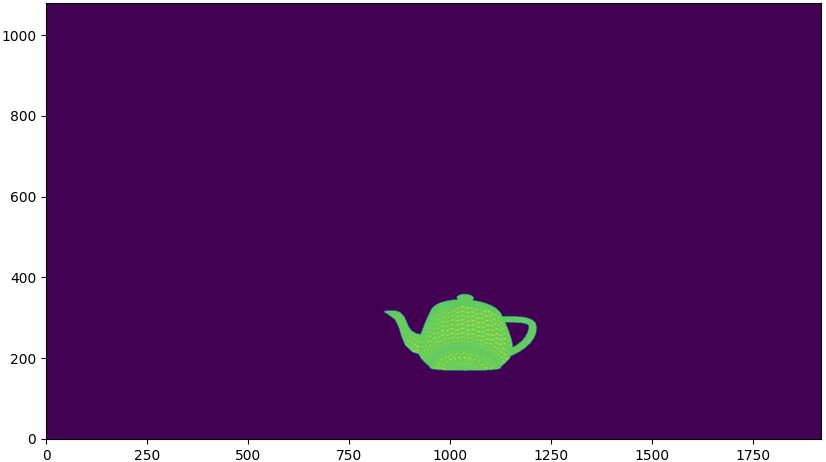

# camplot3d

A 3D perspective transformation and rendering API featuring both pytorch and numpy

## Examples

### Camera position and Field-of-View (fov) calibration

Using machine learning to inference on the position and fov of cameras within the scene.
See [tutorial](examples/multicamera_calibration.py).

Here is a demo video on the training process.

https://user-images.githubusercontent.com/36983956/212569056-79a32a89-d923-4c3d-822d-978bb0cd4b69.mp4

The pink points indicate the cameras whose positions are to be learned. The green points indicates the true camera
positions. The lines are the ray tracing lines for inferencing the positions and fovs.

### Object 3D position detection

After calibrating the cameras, the two cameras are now able to detect the 3D position of any items in the scene.

Here is the object placed in the scene: 

Then, both cameras captures images of the scene:

 

Two tracing rays are generated from the above two images. Here is the position detection result: 

The red point is the true object center (1/2, 1/2, 1/3), and the cyan point is the detected object position (0.4969,
0.5038, 0.3421). The pink rays indicate the tracing rays from the captured.
